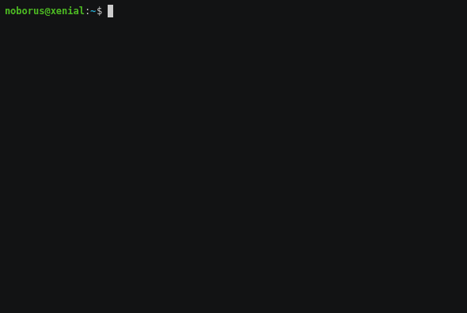

# psutilsql

[](https://godoc.org/github.com/noborus/psutilsql)
[](https://app.fossa.io/projects/git%2Bgithub.com%2Fnoborus%2Fpsutilsql?ref=badge_shield)

CLI tool that can be processed by SQL using  [gopsutil](https://github.com/shirou/gopsutil) library.

SQL input/output is handled by [trdsql](https://github.com/noborus/trdsql).
Therefore, CSV, JSON, LTSV, MarkDown, Raw, Vertical, and TBLN can be selected as the output format.



## install

```console
$ go get -u github.com/noborus/psutilsql...
```

psutilsql depends on [go-sqlite3](https://github.com/mattn/go-sqlite3).
Therefore, gcc is required to build.

## Usage

```console
$ psutilsql command
```

### SQL

The query command(\<query\> can be omitted) can execute SQL.

```console
$ psutilsql query "SELECT Total,Used,Free FROM virtualmemory"
or     
$ psutilsql "SELECT Total,Used,Free FROM virtualmemory"       

+-------------+------------+------------+
|    Total    |    Used    |    Free    |
+-------------+------------+------------+
| 16687091712 | 6468083712 | 2399399936 |
+-------------+------------+------------+
```

#### Table list

List of table names that can be used.

Displayed with the following command:
```console
$ psutilsql table
```

|      name       |
|-----------------|
| cpuinfo         |
| cpupercent      |
| cputime         |
| diskpartition   |
| diskusage       |
| docker          |
| hostinfo        |
| hosttemperature |
| hostuser        |
| loadavg         |
| loadmisc        |
| net             |
| process         |
| processex       |
| swapmemory      |
| virtualmemory   |


### Command

Display values using command and options without using SQL.

```console
$ psutilsql host --users
+---------+----------+------+------------+
|  User   | Terminal | Host |  Started   |
+---------+----------+------+------------+
| noborus | tty7     | :0   | 1564096509 |
+---------+----------+------+------------+
```

```console
$ psutilsql --help
SQL for running processes and system utilization.

SQL can be executed on the information acquired using gopsutil library.
Default SQL is provided, so you can omit SQL if you select a command.

Usage:
  psutilsql [flags]
  psutilsql [command]

Available Commands:
  completion  Generates bash/zsh completion scripts
  cpu         CPU information
  disk        DISK information
  docker      docker information
  help        Help about any command
  host        host information
  load        load information
  mem         memory information
  net         net information
  process     process information
  query       SQL query command
  table       table list

Flags:
  -d, --Delimiter string   output delimiter (CSV only) (default ",")
  -O, --Header             output header (CSV only)
  -o, --OutFormat string   output format=at|csv|ltsv|json|tbln|raw|md|vf (default "at")
  -q, --Query string       query
  -h, --help               help for psutilsql
  -t, --toggle             Help message for toggle

Use "psutilsql [command] --help" for more information about a command.
```

### cpu

--time: cpu time(default)

| CPU | User | System | Idle | Nice | Iowait | Irq | Softirq | Steal | Guest | GuestNice |
|-----|------|--------|------|------|--------|-----|---------|-------|-------|-----------|

--info, -i: cpu info

| CPU | VendorID | Family | Model | Stepping | PhysicalID | CoreID | Cores | ModelName | Mhz | CacheSize | Flags | Microcode |
|-----|----------|--------|-------|----------|------------|--------|-------|-----------|-----|-----------|-------|-----------|

--percent,-p: cpu percent

### disk

--partition: disk partition(default)

| Device | Mountpoint | Fstype | Opts |
|--------|------------|--------|------|

--usage [disk]: disk usage

| Path | Fstype | Total | Free | Used | UsedPercent | InodesTotal | InodesUsed |InodesFree | InodesUsedPercent |
|------|--------|-------|------|------|-------------|-------------|------------|------------|-------------------|

### docker

| ContainerID | Name | Image | Status | Running |
|-------------|------|-------|--------|---------|


### host

--info: host information(default)

| Hostname | Uptime | BootTime | Procs | OS | Platform | PlatformFamily | PlatformVersion | KernelVersion | VirtualizationSystem | VirtualizationRole | HostID |
|----------|--------|----------|-------|----|----------|----------------|-----------------|---------------|----------------------|--------------------|--------|

--user,-u: user information

| User | Terminal | Host | Started |
|------|----------|------|---------|

--temperatures, -t: SensorsTemperatures

| SensorKey | Temperature |
|-----------|-------------|


### load

| Load1 | Load5 | Load15 |
|-------|-------|--------|

--misc,-m: miscellaneous host-wide statistics

| ProcsTotal | ProcsRunning | ProcsBlocked | Ctxt |
|------------|--------------|--------------|------|

### mem

VirtualMemory(default)

| Total | Available | Used | UsedPercent | Free | Active | Inactive | Wired | Laundry | Buffers | Cached | Writeback | Dirty | WritebackTmp | Shared | Slab | SReclaimable | SUnreclaim | PageTables | SwapCached | CommitLimit | CommittedAS | HighTotal | HighFree | LowTotal | LowFree | SwapTotal | SwapFree | Mapped | VMallocTotal | VMallocUsed | VMallocChunk | HugePagesTotal | HugePagesFree | HugePageSize |
|-------|-----------|------|-------------|------|--------|----------|-------|---------|---------|--------|-----------|-------|--------------|--------|------|--------------|------------|------------|------------|-------------|-------------|-----------|----------|----------|---------|-----------|----------|--------|--------------|-------------|--------------|----------------|---------------|--------------|

--swap, -s: SwapMemory

| Total | Used | Free | UsedPercent | Sin | Sout | PgIn | PgOut | PgFault |
|-------|------|------|-------------|-----|------|------|-------|---------|


### net

| Fd | Family | Type | LaddrIP | LaddrPort | RaddrIP | RaddrPort | status | Uids | Pid |
|----|--------|------|---------|-----------|---------|-----------|--------|------|-----|

### process

| pid | name | CPU | MEM | STATUS | START | USER | RSS | VMS | Data | Stack | locked | Swap | COMMAND |
|-----|------|-----|-----|--------|-------|------|-----|-----|------|-------|--------|------|---------|

--ex: memory info ex

| pid | name | CPU | MEM | STATUS | START | USER | RSS | VMS | Shared | Text | Lib | Data | Dirty | COMMAND |
|-----|------|-----|-----|--------|-------|------|-----|-----|--------|------|-----|------|-------|---------|


## License
[](https://app.fossa.io/projects/git%2Bgithub.com%2Fnoborus%2Fpsutilsql?ref=badge_large)
